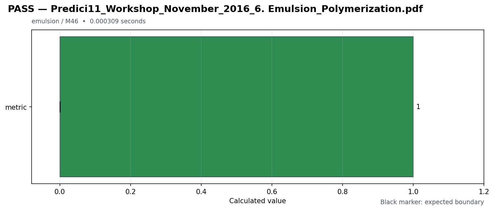

# Test result: Predici11_Workshop_November_2016_6. Emulsion_Polymerization.pdf

이 디렉터리는 `Predici11_Workshop_November_2016_6. Emulsion_Polymerization.pdf` 재현 시나리오의 개별 실행 결과입니다.

- 결과: **PASS 1 / FAIL 0 / SKIP 0**
- PDF 커버리지: **1 / 39 (2.56%)**
- 실행 명령: `python main_program25.py`
- 생성 시각(UTC): `2026-07-16T00:52:00.485325+00:00`

## 결과 그림

## 파일

- [input.json](input.json): 시나리오 입력 메타데이터와 기대 범위
- [report.html](report.html): feature, milestone, PDF별 브라우저 보고서
- [result.md](result.md): PDF별 지표와 기대 범위를 모두 포함한 Markdown 결과
- [result.json](result.json): 실행 환경, 집계, 개별 결과를 포함한 구조화 결과
- [result.csv](result.csv): PDF당 한 행으로 정리한 스프레드시트용 결과
- [result.png](result.png): README와 HTML에 포함된 결과 그림
- [main_program25.py](main_program25.py): `input.json`을 읽어 이 시나리오를 다시 실행

## PDF와 시나리오 매핑

| PDF | Example ID | Feature | Milestone | Status |
| --- | --- | --- | --- | --- |
| Predici11_Workshop_November_2016_6. Emulsion_Polymerization.pdf | `predici11_workshop_november_2016_6_emulsion_polymerization` | `emulsion` | `M46` | **PASS** |
